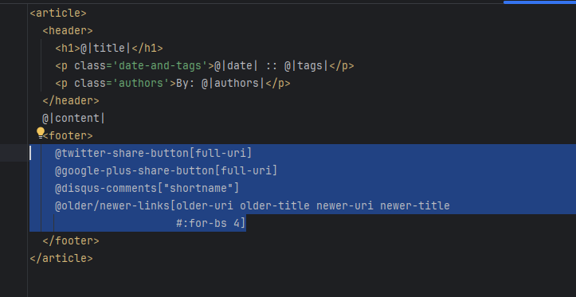
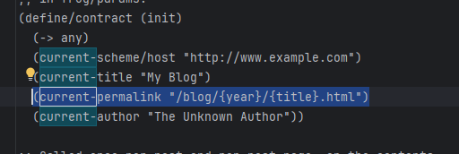
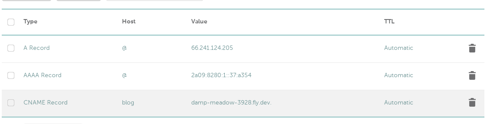

    Title: Technical details on this site
    Date: 2023-11-10T12:40:57
    Tags: software, web

This post contains info about how this site works.
TLDR: use frog site generator, build with fish, build image with goStatic, deploy to fly.io

<!-- more -->

## Step 0: installing racket & frog
 Install [Racket](https://racket-lang.org/) on your computer. Install frog using raco: 
```
$ raco pkg install frog
```
see [frog guide](https://docs.racket-lang.org/frog/Quick_start.html)

Use command:
```
$ raco frog -n "Blog post title"
```
to create your first (hopefully not last) post.

## Step 1: generating static site from md
Static site generator has to be simple to use and lightweight, and [frog](https://docs.racket-lang.org/frog/index.html) fits the requirements. At first, I've tried to follow Luke Smith's [video](https://www.youtube.com/watch?v=ZFL09qhKi5I) on static sites & Hugo generator, but it turned out too complicated for my needs.\
Follow frog documentation to generate site pages. **IMPORTANT** for weired reasons, frog places social media footer on your page, with all sorts of internet syphilis: tw*tter, g**gle-plus, digus(wtf is that, imagine being called 'digus', LMAO). Goto _src/post-template.html and remove footer section:

One more thing to do - change blog layout in frog.rkt so generated pages end in one folder:

Now we can copy all bog files into container at once!

## Step 2: into container it goes
Fly.io [static site guide](https://fly.io/docs/languages-and-frameworks/static/) has pretty solid instructions on how to serve html's. It uses goStatic server, and it works without TLS certificates (we'll set certs later). If something works, don't break it! COPY generated site directories & files into goStatic container(without racket code & _src dir) and deploy it. 

## Step 3: deploying container
There are some guides online about hosting on a VPS, and it is great option, if you like to set up Docker over ssh. But, using service that just runs containers will save you some time. There little reason to host stuff outside containers, and VPS provides no additional security/durability/performance/efficiency - if you post stuff that upsets media, WEF of billionaires, you'll get kicked out. \
[Fly.io](https://fly.io/docs/about/pricing/) has free plan that is more than capable handling static sites, and handles containerized apps, so no headache for you. Set up flyctl and deploy! See [Speedrun](https://fly.io/docs/speedrun/) for more details.

## Step 4: DNS
I own 'troideann.site' domain name on namecheap. To point in on flyio shared ip address, I set it uo like this: 
CNAME record is probably not required. After that, go to fly console (flyctl) and create certificate for your domain name.
How it works? You send HTTP GET request on IP adress, resolved using DNS. Your request contains "Host" header with required domain name. Flyio reverse proxy reads this header and  redirects your request to container, that probably sits inside internal network. Since you have properly configured DNS records and configured flyio certs, flyio has required certificates to establish HTTPS connection.

## Step 5: that's it!
You should be able to access your static site on your domain name. Enjoy your mostly free site (excluding domain name)

## Step 6: todo
### generated site uses bootstrap
I don't feel like it is something I need.
### generated site uses google analytics
And searching on frog documentation for 'google' or 'anal' yeilds no results
### using free .tk domain is proboably possible
(.tk is under lawsuit from Meta as for now)

### Action points: 
- move from frog to even simpler site generator
- acquire free domain name
- use CDN for images (apparently https://vercel.com/ provide some)